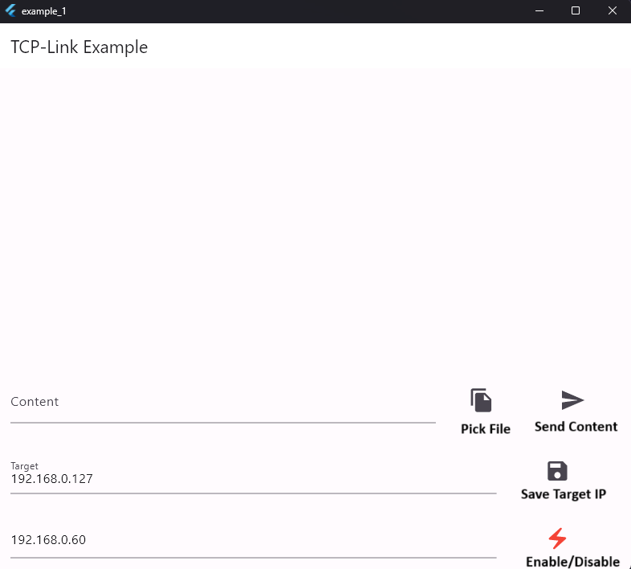
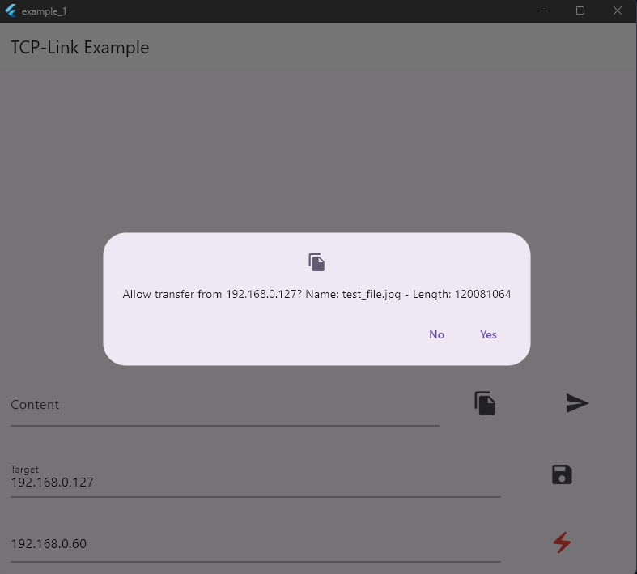
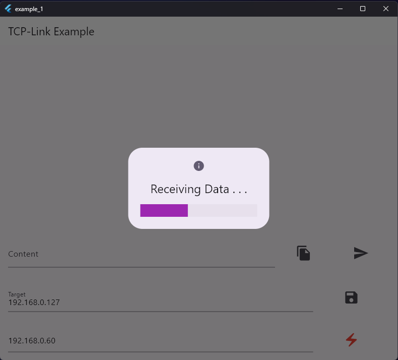

This package provides functionality for TCP/IP communication between devices.

Please refer to https://github.com/BenediktJSchlegel/tcp_link/tree/master/example for example usage.


## Basic Usage:

### Sending:

1. Initialize the Sender
``` dart
final sender = LinkSender(
    loggingConfiguration: LoggingConfiguration.print(LoggingVerbosity.info),
    configuration: SenderConfiguration("<SENDER_IP>", 10),
);
```
2. Send some data

``` dart
DataSendResult sendResult = await sender.sendString(SenderTarget("<TARGET_IP>", <PORT>), "This is my data!");
```

### Receiving:

1. Register and start the Receiver
``` dart
final receiver = LinkReceiver(
    onTransferPermissionRequestedCallback: (request) => _onHandshakeReceived(request),
    loggingConfiguration: LoggingConfiguration.print(LoggingVerbosity.info),
    config: LinkConfiguration(ip: "<IP>", port: <PORT>, bufferPath: "<PATH_TO_BUFFER_TO>"),
);

receiver.start();
```
2. Define the Handshake-Callback. This will handle the receiving of data once a handshake is accepted.
``` dart 
  Future<void> _onHandshakeReceived(PermissionRequest request) async{
    request.accept().listen((event) {
      switch (event.runtimeType) {
        case ProgressReceiveEvent:
          print("Made Progress!");
          break;
        case FailedReceiveEvent:
          print("Failed");
          break;
        case DoneReceiveEvent:
          print("Finished");
          break;
      }
    });
  }
```

## Example App






